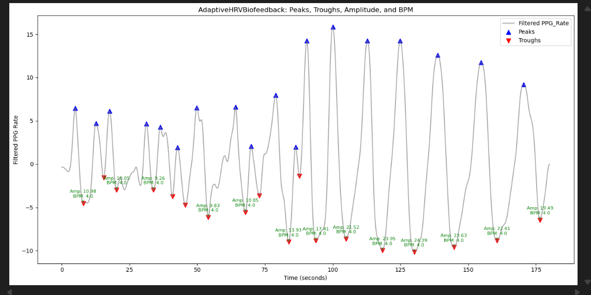
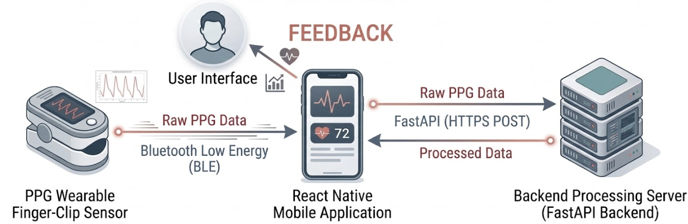
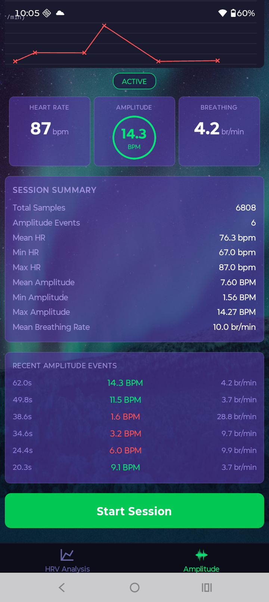
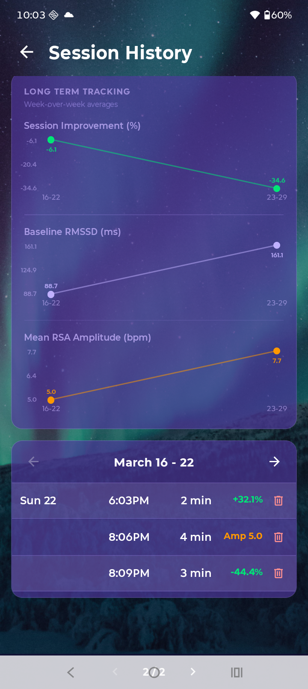
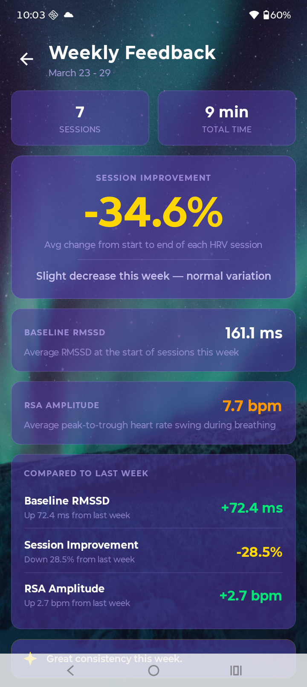
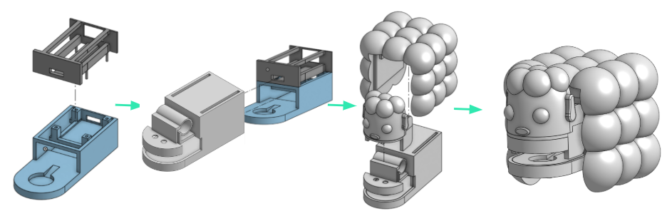
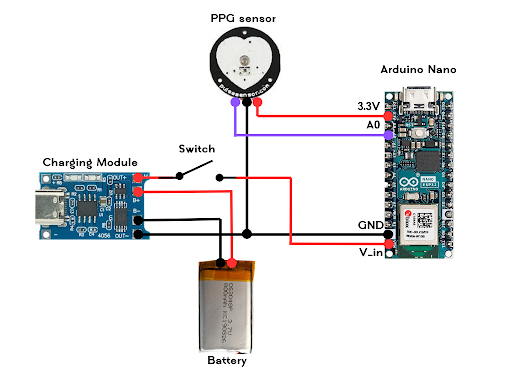

# Biofeedback-Anxiety-Reduction-System-Capstone
Heart Rate Variability (HRV) involves metrics highly associated with parasympathetic nervous system activation, or in other words, calm. During inhalation, heart rate increases and during exhalation, heart rate decreases. This phenomenon is known as Respiratory Sinus Arrythmia. Plotting heart rate over time displays a wave profile. Increasing the amplitude of this wave, is increasing HRV and thus calm. _CalmCoach_ determines the amplitude of this wave profile and provides real-time feedback enabling the user to adjust breathing to maximize this amplitude. The user simply clips the device to their finger, and _CalmCoach_ does the rest.

### System Diagram

### CalmCoach App
 

  

### Assembly

### Circuitry

### Team

