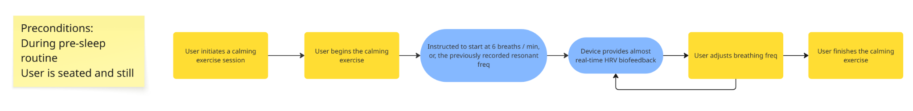
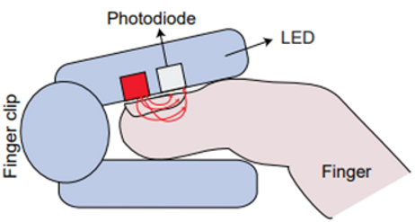

# Biofeedback-Anxiety-Reduction-System-Capstone

What you do before you sleep has a significant effect on your sleep quality. Heart rate variability biofeedback (HRV-BF) has been proven to promote feelings of calmness, which is important for health, performance, and getting ready for a good night’s sleep. CalmCoach provides HRV-BF, allowing you to better prepare for sleep, and train your breathing to promote calmness.

During inhalation, heart rate increases and during exhalation, heart rate decreases. This phenomenon is known as Respiratory Sinus Arrythmia.
Plotting heart rate over time displays a wave profile. Increasing the amplitude of this wave, is increasing HRV and thus calm. CalmCoach uses PPG Sensor data to determine the amplitude of this wave profile and provides real-time feedback enabling the user to adjust breathing to maximize this amplitude.

Our workflow:

PPG sensors work by:

Here is our system diagram:

Here is the live ppg viewer screen of the app:

The team:

