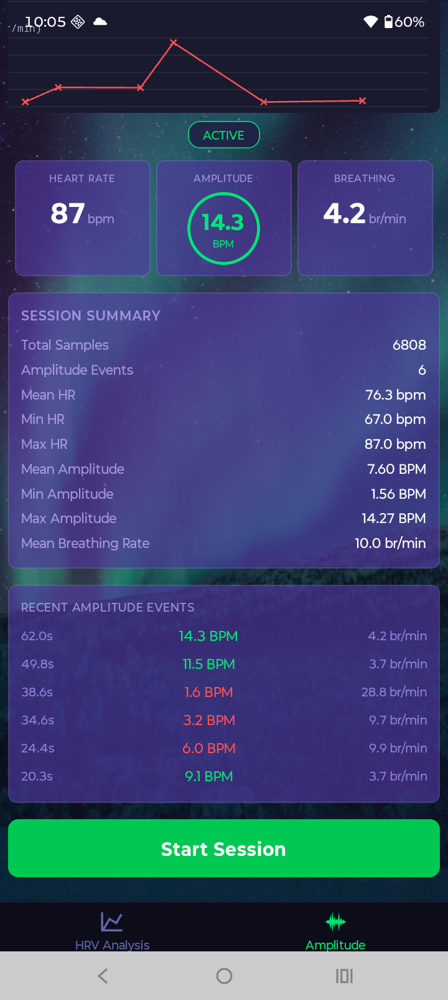
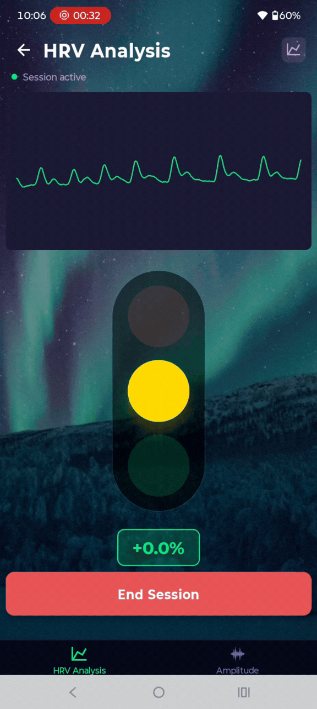
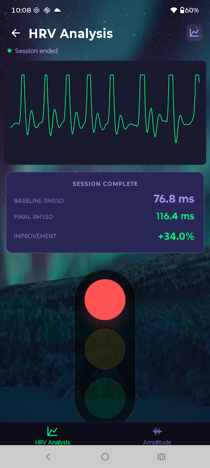
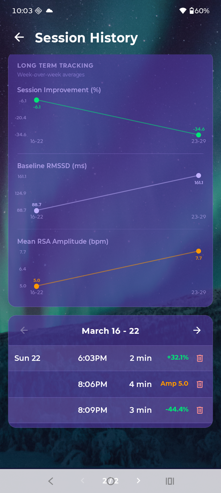
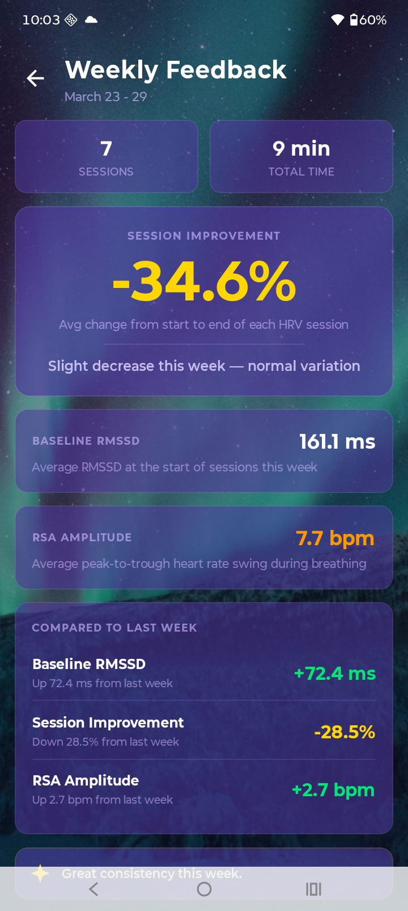
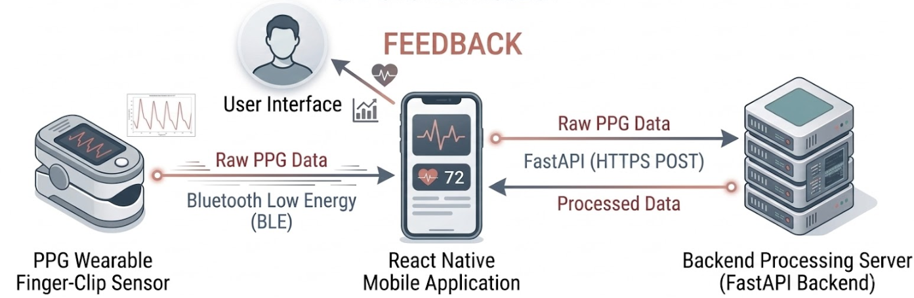
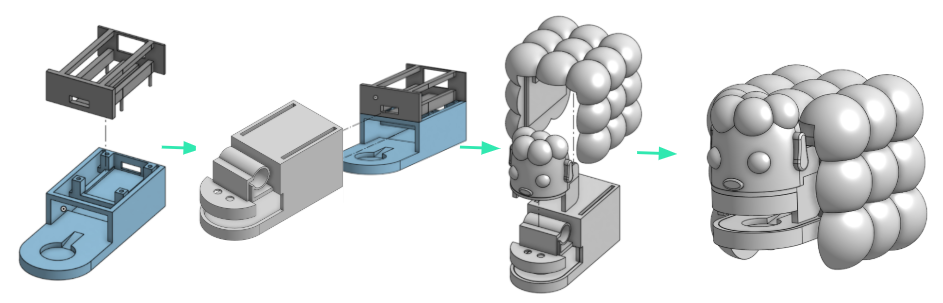
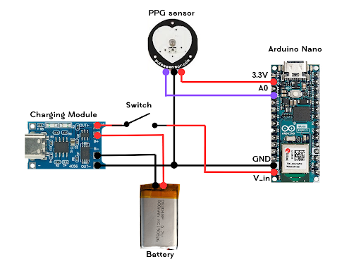
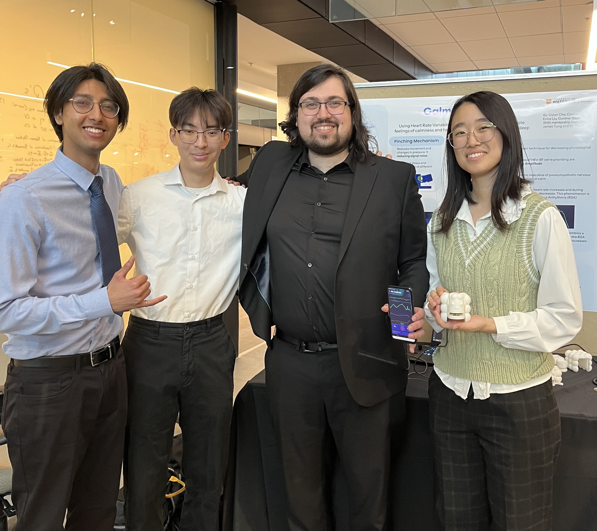

# Biofeedback-Anxiety-Reduction-System-Capstone

_CalmCoach_ delivers a clinically validated method of promoting calm through Heart Rate Variability Biofeedback. By monitoring physiological signals and generating real-time feedback, _CalmCoach_ guides breathing patterns that stimulate the parasympathetic nervous system and induce calm. Simply clip the device to your finger, and _CalmCoach_ handles the rest.

### CalmCoach App

CalmCoach provides calm through two features:

**RSA Amplitude**  
    
During inhalation, your heart rate increases and during exhalation your heart rate decreases. This phenomenon is known as Respiratory Sinus Arrhythmia (RSA). During paced breathing, the heart rate graph resembles a wave and the height of this wave is the RSA amplitude. Maximizing the RSA amplitude leads to efficient breathing and promotes calm. Users aim to synchronise their breathing to the heart rate graph, by inhaling when their heart rate increases and exhaling when their heart rate decreases. Colour and sound feedback guide users to improve their technique and maximize RSA amplitude.

**Vagus Nerve Activity HRV**  
   
The vagus nerve connects the brain and the heart and is an important part of the calming and restful parasympathetic nervous system. By taking the Root Mean Square of Successive Differences (RMSSD) of the time between heart beats, vagus nerve activity can be measured and evaluated. A higher RMSSD indicates more vagus nerve activity, showing that your body is starting to relax. Vagus nerve activity is measured every 10 seconds while colour/sound feedback is provided. Users naturally increase their RMSSD throughout the session by aiming for positive feedback.

**History and Weekly Feedback**  
  

### System Diagram

### Assembly

### Circuitry

### Team

